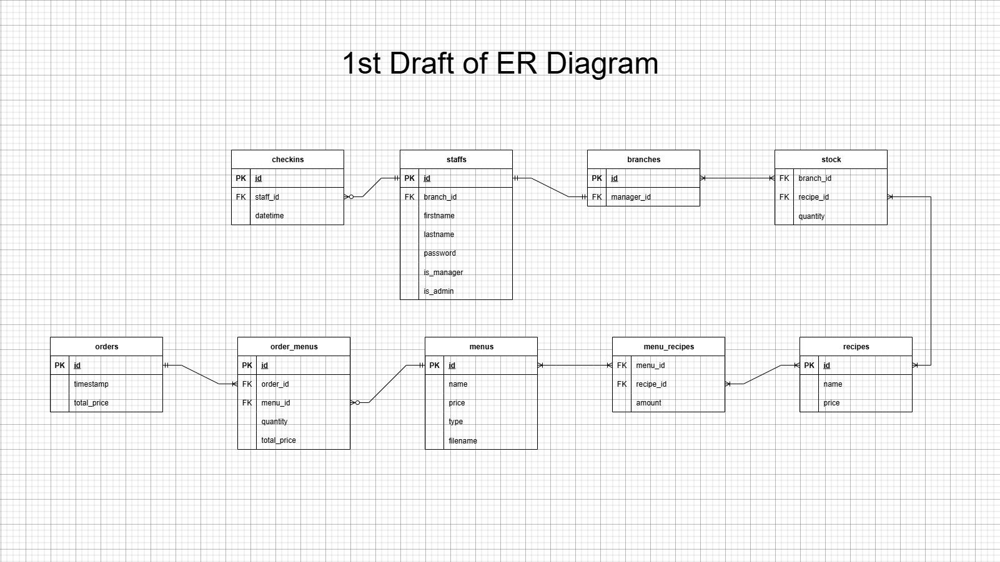
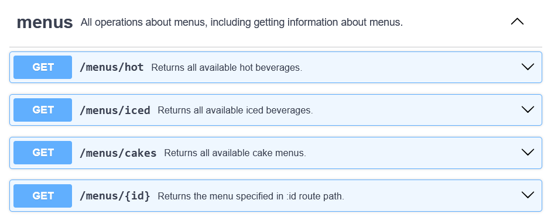
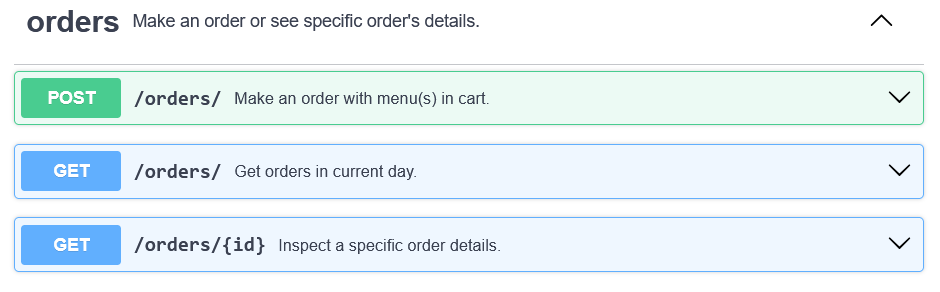
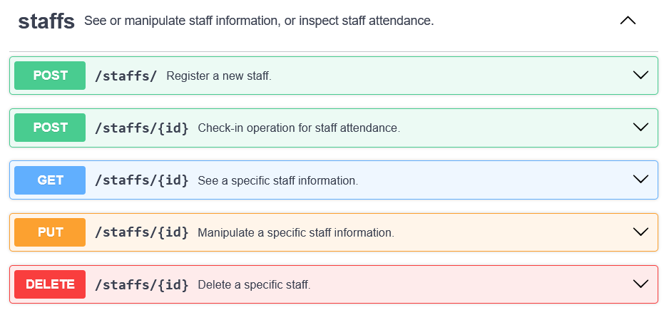
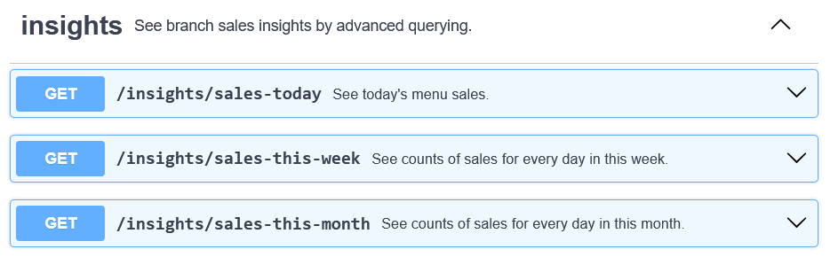

# ระบบ POS สำหรับแฟรนไชส์ร้านกาแฟ
# (POS System for Cafe Franchise)

---

# Team Members

- 65200125 นาย ตุลยวัต ชนูดหอม
- 65200162 นาย ธนาดร รัชตะปีติ

# Advisors

1. อาจารย์ นภัสรพี สิทธิวัจน์ (Advisor)
2. อาจารย์ อรรถศาสตร์ นาคเทวัญ (Co-advisor)

---

# ที่มาและความสำคัญของโครงงาน
## (Origin and Importance of the Project)

โครงงานนี้เกิดจากความสนใจของผู้จัดทำที่มองเห็นปัญหาในการบริหารจัดการร้านกาแฟขนาดเล็กถึงขนาดกลางที่ยังไม่มีระบบ POS ที่สามารถรองรับการทำงานในหลายสาขา หรือมีระบบที่ครอบคลุมฟังก์ชันที่จำเป็นในชีวิตจริง เช่น การตรวจสอบการเข้างานของพนักงาน การวิเคราะห์ยอดขายแบบเรียลไทม์ หรือการจัดการสต็อกวัตถุดิบตามสูตรของแต่ละเมนู ซึ่งฟังก์ชันเหล่านี้ล้วนเป็นสิ่งที่มีความจำเป็นต่อการดำเนินธุรกิจแฟรนไชส์ในระยะยาว

---

# ที่มาและความสำคัญของโครงงาน [2]
## (Origin and Importance of the Project) [2]

นอกจากนี้ ผู้จัดทำยังเล็งเห็นว่าโครงการนี้สามารถนำไปต่อยอดในอนาคตได้ ทั้งในเชิงของการพัฒนาเป็นระบบ POS สำหรับธุรกิจจริง หรือการสร้างเป็นผลิตภัณฑ์ต้นแบบ (Prototype) เพื่อใช้นำเสนอแนวคิดเชิงธุรกิจต่อผู้ประกอบการหรือในเวทีแข่งขันโครงงานต่าง ๆ ได้อีกด้วย ด้วยเหตุนี้เอง จึงเป็นแรงบันดาลใจให้ผู้จัดทำเลือกพัฒนาโครงงานระบบ POS สำหรับแฟรนไชส์ร้านกาแฟ โดยใช้เทคโนโลยีที่ทันสมัย และออกแบบระบบให้สามารถปรับขยายได้ในอนาคต

---

# วัตถุประสงค์ของโครงงาน
## (Objectives of the Project)

1. พัฒนาระบบ POS ที่มีลักษณะเป็น Web Application
2. พัฒนาระบบ POS ให้สามารถใช้งานได้ตามที่กำหนดไว้จาก Requirements
3. ออกแบบและสร้างฐานข้อมูลให้สามารถรองรับการดำเนินการของระบบ POS
4. พัฒนา Program สำหรับการวิเคราะห์ข้อมูลจากข้อมูลการดำเนินธุรกิจที่เก็บไว้ในฐานข้อมูล
5. นำระบบ POS รวมทั้งส่วนอื่นๆ ที่ได้พัฒนาไปทดสอบการใช้งานบนสภาพแวดล้อมจริง (Servers, Networks, IT Devices)

---

# ขอบเขตของโครงงาน
## (Scopes of the Project)

- 3 roles in the system: staff, manager, administrator.
- Database server ที่รองรับการเข้าถึงจากระบบร้านกาแฟในหลายๆ สาขา
- Dashboard สำหรับวิเคราะห์การขายของแต่ละสาขา
- ตัว Software มีลักษณะเป็น Webapp
- การตรวจสอบการเข้างานของพนักงานโดย Manager
- การสร้างใบเสร็จการสั่งซื้อในรูปแบบ PDF จัดเก็บไฟล์บน Server
- การติดตามสต็อกของวัตถุดิบ
- การเพิ่ม, ลบ, แก้ไข Menus ของแฟรนไซส์โดย Administrator
- วิเคราะห์ข้อมูลการดำเนินธุรกิจแฟรนไซส์ในระดับ Administrator

---

# Tech Stack

- **Client:** Next.js, TypeScript, Bootstrap.
- **Server:** NestJS.
- **Database:** PostgreSQL, Prisma (ORM.)
- **Deployment, CI/CD:** Docker, Nginx, GitHub Actions.
- **Testing:** Jest.
- **Data Analysis:** Python, NumPy, Pandas, or any related tools.

---

# 1st Draft of ER Diagram

---

# 1st Draft of Menus API Specification

---

# 1st Draft of Orders API Specification

---

# 1st Draft of Staffs API Specification

---

# 1st Draft of Insights API Specification

---

# แผนการดำเนินงาน (Project Plan)
## 1st Semester

- ศึกษา Tools และ Technologies ที่จะเลือกใช้ในการพัฒนา
- ออกแบบฟังก์ชันการทำงานของ Software ให้เป็นไปตาม Requirements
- พัฒนาส่วนต่างๆ ของ Software (Database, Backend, Frontend, etc.) ด้วย Technologies ที่เลือกใช้
- ทดสอบฟังก์ชันการทำงานของ Software ว่าให้ผลลัพธ์ที่ถูกต้องตรงตามความต้องการ
- นำ Software ที่พัฒนาไป Deploy บน Server และ Network จริง

---

# แผนการดำเนินงาน (Project Plan)
## 2nd Semester

- จัดทำรูปเล่มโครงงาน
- ปรับปรุงแก้ไขงานที่ทำในภาคเรียนที่ 1 ให้เสร็จสมบูรณ์
- นำเสนอโครงงาน

---

# ประโยชน์ที่คาดว่าจะได้รับจากโครงงาน
## (Anticipated Benefits of the Project)

1. ตัวระบบ POS สามารถใช้ดำเนินการสั่งซื้อเมนูของแฟรนไซส์ร้านกาแฟได้
2. ตัวระบบ POS สามารถแสดง Data Visualization ของข้อมูลการขายของร้านกาแฟ
แต่ละสาขาได้
3. มีฐานข้อมูลที่สามารถรองรับการเข้าถึงและการดำเนินการต่างๆ จากระบบ POS
ในหลายๆ สาขาได้
4. สามารถใช้ข้อมูลที่มีในฐานข้อมูลมาทำ Data Analysis เพื่อวิเคราะห์ผลการดำเนินธุรกิจ
แฟรนไซส์ได้
5. โครงงานมีความสมบูรณ์ในระดับที่สามารถนำไปใช้ในการดำเนินธุรกิจจริงได้

---

# Resources

- API Specification in Postman/Swagger
- ER Diagram in draw.io
- UML Diagrams for Key Operations
- Figma Design
- Markdown Documentation
- Git Repository